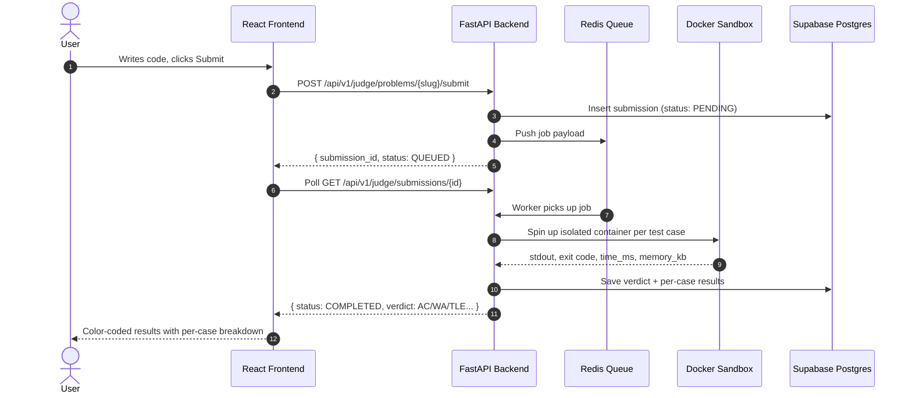
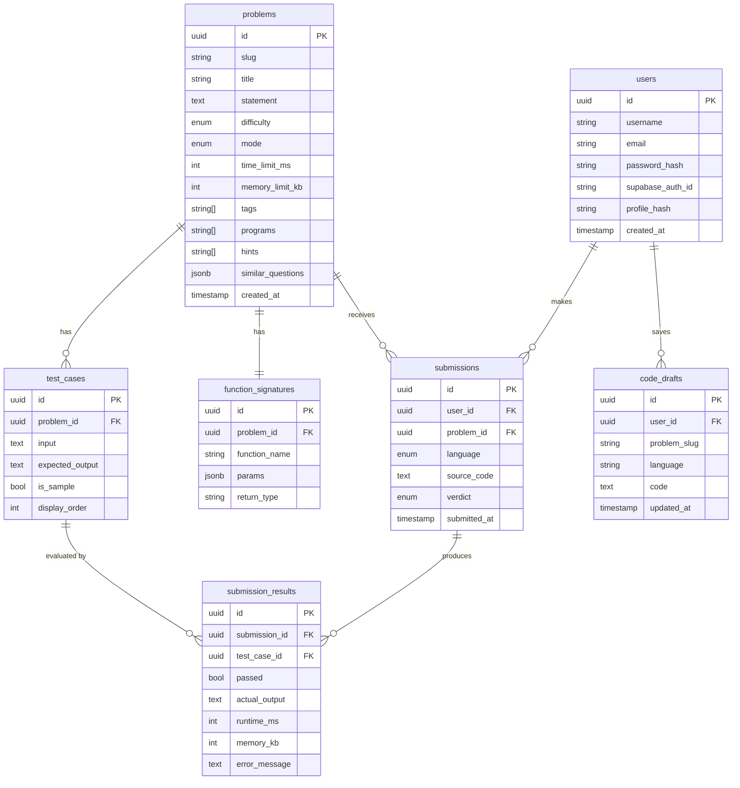

# CodePulse — Sandboxed Online Judge & DSA Learning Platform

[](https://frontend-iota-eosin-36.vercel.app)
[](https://fastapi.tiangolo.com)
[](https://react.dev)
[](https://supabase.com)
[](https://www.docker.com)
[](https://redis.io)

**CodePulse** is a full-stack competitive programming and DSA learning platform. Solve 34+ algorithmic problems in C++, Python, and Java — every submission runs in a disposable Docker sandbox with strict Linux cgroup resource limits, graded asynchronously through a Redis queue. Plus an interactive SVG-based DSA Mind Map, interview cheatsheets, and step-by-step algorithm visualisers — all free, no login required.

🌐 **Live:** https://frontend-iota-eosin-36.vercel.app

---

## ✨ Features

### 🗺️ Interactive DSA Mind Map
- **16 category nodes** branching with animated bezier curves (Sliding Window, Two Pointers, DP, Graphs, Trees, Heap, Trie, Bit Manipulation, and more)
- **3-level SVG hierarchy**: Categories → Sub-categories → Leaf pattern techniques
- Animated flowing dash strokes on all branch links (live energy effect)
- Floating **algorithm details panel** on category click: description, key insight, must-know problems
- Click any leaf node to open the **Pattern Detail Visualiser**

### 📚 Pattern Detail Visualiser
- Step-by-step interactive animations for core patterns (Two Sum hash map, Binary Search boundaries, Three Sum two-pointer, Best Stock sliding, Reverse Linked List)
- **Python & C++ code snippets** with tabbed syntax view
- **Complexity Analysis** tab with time / space breakdown and key interview notes
- Play / Pause / Step controls with auto-advance mode

### 📝 DSA Interview Cheatsheet
- Complete **Pattern Recognition Tips** — 12 decision heuristics to identify the right algorithm instantly
- **12 category tables** with Pattern, When to Use, Key Idea, and Time columns (scraped from dsamindmap.com)
- **Data Structure Operations** comparison table (Array → Trie)
- **Sorting Algorithms Comparison** (Quick, Merge, Heap, Bubble, Insertion, Counting — best/avg/worst/space/stable)

### 🧠 Problem Solving
- **34+ curated problems** across Easy, Medium, and Hard difficulty
- Problems support two modes: **function-mode** (auto-wrapped driver code) and **stdin-mode**
- Tag-based filtering (Arrays, Trees, DP, Graphs, etc.)
- Per-problem hints and similar question suggestions
- Monaco Editor with syntax highlighting for C++, Python, and Java

### ⚡ Code Execution & Judging
- **Run** code against custom input instantly (no verdict, just output)
- **Submit** code for full test-case evaluation with per-case pass/fail breakdown
- Verdicts: `AC` · `WA` · `TLE` · `MLE` · `RE` · `CE`
- Async grading via **Redis queue** — API returns immediately, frontend polls for result
- Per-problem **time limit** (default 2s) and **memory limit** (256MB)

### 🔒 Sandboxed Execution
Every submission runs inside a **disposable Docker container** with:

| Limit | Value | Enforced By |
|-------|-------|-------------|
| Memory | 256 MB | `docker -m 256m` |
| CPU | 0.5 cores | `docker --cpus=0.5` |
| Process/fork limit | 64 PIDs | `docker --pids-limit=64` |
| Network access | None | `docker --network none` |
| Filesystem | Read-only | `docker --read-only` |
| Wall-clock timeout | Per-problem (default 2s) | Host watchdog thread |

### 💾 Code Draft Persistence
- Code is **saved instantly** to `localStorage` on every keystroke
- For logged-in users, code is **debounce-synced to Supabase** after 8 seconds of inactivity
- Drafts are restored automatically when returning to a problem (per language)

### 👤 User Profiles
- **Activity heatmap** — GitHub-style daily submission frequency grid
- **Streak tracking** — current streak and max streak (in days)
- **Accuracy** — percentage of submissions that received AC verdict
- **Difficulty breakdown** — Easy / Medium / Hard solved counts with progress bars
- **Tag distribution** — bubble chart showing solved vs total per topic
- **Solved problems list** — filterable by difficulty and title

### 🔐 Authentication
- **Google OAuth** via Supabase Auth (one-click sign-in)
- **Email/password** login and registration
- JWT-based session with support for both local JWTs and Supabase JWTs
- DSA Map and Cheatsheet are **fully public** — no login required

### 🖥️ Standalone Compiler
- A full **code playground** page (no problem required)
- Run any C++, Python, or Java code against custom stdin
- Useful for quick experiments without creating a submission

### 🎨 Design System
- **Dual dark/light theme** with CSS variable tokens
- Dark mode palette: `#000000` base · `#FCA311` gold-orange accent · `#FFFFFF` text
- Animated glassmorphism UI, micro-interactions, and smooth transition animations
- Distinct typography per DSA category node using Google Fonts (Outfit, Playfair Display, Fira Code)

---

## 🏗️ System Architecture

```
Browser (Vercel CDN)
        │
        │  HTTPS via Cloudflare Tunnel (VITE_API_URL)
        ▼
FastAPI Backend (localhost:8000)
        │
        ├── Supabase Postgres  ← users, problems, submissions, drafts
        ├── Redis Queue        ← async submission jobs
        ├── Docker Engine      ← sandboxed code execution
        └── Supabase Auth      ← Google OAuth + JWT validation
```

### Submission Flow



---

## 🗄️ Database Schema



---

## 🚀 Local Development

### Prerequisites
- Docker Desktop running
- Python 3.11+, Node.js 20+
- Supabase project (for auth features, optional)

### Quick Start

```bash
# Clone
git clone https://github.com/your-username/online-judge.git
cd online-judge

# Backend
cd backend
python -m venv venv && source venv/bin/activate
pip install -r requirements.txt
cp .env.example .env   # fill in DB + Supabase credentials
alembic upgrade head
uvicorn app.main:app --reload --port 8000

# Frontend (new terminal)
cd frontend
npm install
cp .env.example .env   # set VITE_API_URL=http://localhost:8000
npm run dev
```

Visit `http://localhost:5173` — the DSA Map and Cheatsheet work immediately with no backend required.

### Environment Variables

**Backend `.env`**
```
DATABASE_URL=postgresql+asyncpg://...
SUPABASE_URL=https://xxx.supabase.co
SUPABASE_JWT_SECRET=...
SECRET_KEY=...
```

**Frontend `.env`**
```
VITE_API_URL=http://localhost:8000
VITE_SUPABASE_URL=https://xxx.supabase.co
VITE_SUPABASE_ANON_KEY=...
```

---

## 📁 Project Structure

```
online-judge/
├── backend/
│   ├── app/
│   │   ├── judge/        ← submission, execution, grading
│   │   ├── user/         ← auth, profiles
│   │   ├── db/           ← models, migrations
│   │   └── main.py
│   └── requirements.txt
├── frontend/
│   └── src/
│       ├── components/
│       │   ├── DsaMindMap.jsx       ← 3-level interactive SVG mind map
│       │   ├── DsaCheatsheet.jsx    ← full interview cheatsheet
│       │   └── ...
│       ├── pages/
│       │   ├── PatternDetail.jsx    ← algorithm visualiser + code tabs
│       │   ├── LandingPage.jsx
│       │   ├── AuthPage.jsx
│       │   └── ...
│       └── index.css                ← CSS variable dual-theme system
├── .agents/
│   └── skills/
│       └── dsa-map/SKILL.md         ← custom agent skill for DSA map patterns
└── docs/
    └── SETUP.md
```

---

## 🛠️ Tech Stack

| Layer | Technology |
|-------|-----------|
| Frontend | React 18, Vite, Tailwind CSS |
| Backend | FastAPI (async), SQLAlchemy 2.0 |
| Database | Supabase Postgres |
| Auth | Supabase Auth (Google OAuth + JWT) |
| Queue | Redis + custom worker |
| Sandbox | Docker (per-submission containers) |
| Deploy | Vercel (FE) + Cloudflare Tunnel (BE) |

---

## 📜 License

MIT — feel free to fork, study, and build on it.
