# ApexJudge: A Sandboxed Asynchronous Online Judge

[](https://fastapi.tiangolo.com)
[](https://react.dev)
[](https://www.docker.com)
[](https://redis.io)
[](https://tailwindcss.com)

**ApexJudge** is a secure, sandboxed online judge designed to evaluate user-submitted C++ and Python code in real-time. By utilizing Docker containers as micro-sandboxes, it isolates and executes untrusted submissions while enforcing strict kernel-level cgroups resource budgets.

---

## 🏗️ System Architecture

ApexJudge relies on an asynchronous event-driven architecture to decouple heavy compilation and execution sandboxing workloads from the API thread.

```mermaid
sequenceDiagram
    autonumber
    actor User as User / Candidate
    participant FE as React Frontend (Vite)
    participant BE as FastAPI Backend
    participant RD as Redis Queue & Cache
    participant WK as Grader Worker
    participant DK as Docker Sandbox (Isolated Container)

    User->>FE: Submits C++ or Python Code
    FE->>BE: POST /api/v1/submit (code, lang, problem_id)
    BE->>RD: Enqueue grading job & cache state (QUEUED)
    BE-->>FE: HTTP 200 OK (submission_id)
    
    rect rgb(15, 23, 42)
        Note over FE,BE: Frontend polls GET /api/v1/submission/{id} every 1-2s
    end

    WK->>RD: Pulls job from Redis queue (status -> RUNNING)
    WK->>DK: Spins up fresh isolated runner container
    critical Code Execution in Sandbox
        DK->>DK: Compile (C++) & Run test cases (C++/Python)
    option Exceeds time limit (TLE)
        WK->>DK: Host-side external watchdog kills container (SIGKILL)
    end
    DK-->>WK: Exit code, stdout/stderr, execution time, OOM flag
    WK->>WK: Evaluate verdicts (AC, WA, TLE, MLE, RE) per test-case
    WK->>RD: Update cache with final grading results (status -> COMPLETED)
    FE->>BE: GET /api/v1/submission/{id} -> Returns results
    FE->>User: Render color-coded test cards and stdout comparisons
```



---

## 🔒 Security & Sandboxing (Isolation Deep-Dive)

Executing untrusted candidate code on self-hosted servers introduces severe security vulnerabilities (RCE, CPU starvation, memory leak exhaustion, and fork bombs). ApexJudge implements strict defense-in-depth security policies:

### 1. Hard cgroups Resource Limits
Every test run is executed inside a disposable Docker container with strict control groups (cgroups) boundaries:
- **Memory Boundary**: Restricted to `256MB` using Docker's `-m "256m"` flag. Programs exceeding this allocation are killed instantly and graded as Memory Limit Exceeded (`MLE`).
- **CPU Quota**: Shared at `0.5` of a single CPU core using `--cpus="0.5"`, guaranteeing runaway infinite loops cannot starve API processes.
- **Thread/Process Limit (Fork Bomb Protection)**: Enforced at `--pids-limit=64` to prevent candidates from spawning recursive child processes (`os.fork()`) to crash the machine.

### 2. Network Isolation
Containers are launched with the `--network none` flag. Submitted code has zero access to the local loopback, databases, internal network, or the public internet, preventing data exfiltration or reverse shells.

### 3. Read-Only Root Filesystem & Temp Mounts
- The runtime container filesystem is read-only (`--read-only`), meaning binary directories or system files cannot be modified or deleted.
- Shared code and inputs are mounted to `/app` inside the container as **read-only** (`mode=ro`).

### 4. Host-Driven Wall-Clock Watchdog (TLE Detection)
We never rely on the sandbox container to terminate itself. The grader worker initiates an asynchronous host-controlled watchdog thread. If the container does not exit within the problem's time limit (e.g. `2.0s`), the host issues a `docker kill` command directly to the Docker engine.

### 5. Leak-Free Lifecycle (Automated Cleanup)
Containers are run in transient modes and programmatically removed immediately after execution exits (`container.remove(force=True)` in a Python `finally` block). Testing confirms zero container accumulation after multiple consecutive submissions.

---

## 🛠️ Tech Stack

- **Frontend**: React (Vite), Tailwind CSS, Monaco Editor (VS Code core engine).
- **Backend**: Python 3.10+, FastAPI (ASGI Framework).
- **Queue & Cache**: Redis (Submission Queue + Cache Broker).
- **Sandboxing**: Docker Engine API (`docker-py`).

---

## 🚀 Setup & Local Installation

### macOS Host Prerequisites (Apple Silicon M1/M2/M3)
On macOS, Docker runs inside a virtual machine. If using **Colima** instead of Docker Desktop, follow these setup steps to avoid architecture mismatch (Rosetta translation) and volume-mount sharing failures:

1. **Install Native Tools via Apple Silicon Homebrew**:
   ```bash
   /opt/homebrew/bin/brew install colima docker redis
   ```
2. **Start Colima with Native VM Driver**:
   ```bash
   PATH="/opt/homebrew/bin:$$PATH" colima start --cpu 2 --memory 4
   ```
3. **Configure Environment Paths**:
   Ensure your shell points to Colima's native Docker socket:
   ```bash
   export DOCKER_HOST="unix:///Users/kunalb/.colima/default/docker.sock"
   export PATH="/opt/homebrew/bin:$$PATH"
   ```

### Running Backend Locally (Development)
1. Start Redis:
   ```bash
   /opt/homebrew/opt/redis/bin/redis-server /opt/homebrew/etc/redis.conf
   ```
2. Set up virtual environment and install packages:
   ```bash
   cd backend
   python3 -m venv venv
   source venv/bin/activate
   pip install -r requirements.txt
   ```
3. Start the FastAPI API Server:
   ```bash
   uvicorn backend.app.main:app --host 0.0.0.0 --port 8000
   ```
4. Start the Grader Queue Worker:
   ```bash
   PYTHONPATH=. python backend/app/workers/grader.py
   ```

### Running Frontend Locally
1. Install dependencies:
   ```bash
   cd frontend
   npm install
   ```
2. Run the Vite development server:
   ```bash
   npm run dev
   ```
   Open `http://localhost:5173` to access the IDE.

---

## 🔌 API Endpoint Documentation

### 1. Retrieve Problem Catalog
- **Endpoint**: `GET /api/v1/problems`
- **Response** (`200 OK`):
  ```json
  [
    {
      "id": "two-sum",
      "title": "Two Sum",
      "description": "Given an array of integers nums...",
      "time_limit": 2.0,
      "memory_limit": 256
    }
  ]
  ```

### 2. Retrieve Problem Workspace Detail
- **Endpoint**: `GET /api/v1/problems/{id}`
- **Response** (`200 OK`):
  ```json
  {
    "id": "two-sum",
    "title": "Two Sum",
    "description": "Given an array of integers...",
    "time_limit": 2.0,
    "memory_limit": 256,
    "sample_cases": [
      {
        "input": "[2,7,11,15]\n9\n",
        "output": "[0, 1]\n"
      }
    ]
  }
  ```

### 3. Submit Solution Code
- **Endpoint**: `POST /api/v1/submit`
- **Request Body**:
  ```json
  {
    "problem_id": "two-sum",
    "language": "python" | "cpp",
    "source_code": "def solve()..."
  }
  ```
- **Response** (`200 OK`):
  ```json
  {
    "submission_id": "bd207634-4d8e-451e-92a3-ad5f538ee41f",
    "status": "QUEUED"
  }
  ```

### 4. Fetch Submission Status & Verdict Breakdown
- **Endpoint**: `GET /api/v1/submission/{id}`
- **Response** (`200 OK`):
  ```json
  {
    "submission_id": "bd207634-4d8e-451e-92a3-ad5f538ee41f",
    "problem_id": "two-sum",
    "language": "python",
    "status": "COMPLETED",
    "verdict": "AC",
    "error_message": null,
    "test_cases": [
      {
        "case_id": 1,
        "verdict": "AC",
        "time_ms": 124,
        "memory_kb": 0,
        "stdout": "",
        "expected_output": null,
        "error_message": null
      }
    ]
  }
  ```
