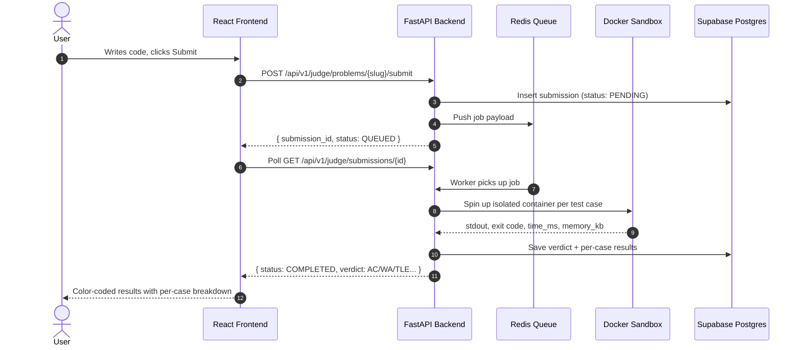
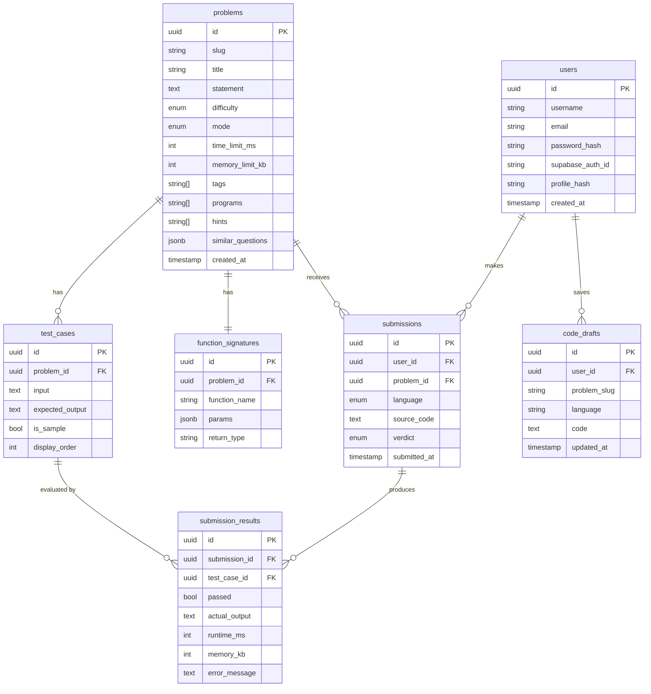

# ApexJudge — Sandboxed Online Judge Platform

[](https://frontend-iota-eosin-36.vercel.app)
[](https://fastapi.tiangolo.com)
[](https://react.dev)
[](https://supabase.com)
[](https://www.docker.com)
[](https://redis.io)

**ApexJudge** is a full-stack competitive programming platform where users solve 34+ algorithmic problems in C++, Python, and Java. Every submission runs in a disposable Docker sandbox with strict Linux cgroup resource limits, graded asynchronously through a Redis queue, and results are returned in real-time.

🌐 **Live:** https://frontend-iota-eosin-36.vercel.app

---

## ✨ Features

### 🧠 Problem Solving
- **34+ curated problems** across Easy, Medium, and Hard difficulty
- Problems support two modes: **function-mode** (auto-wrapped driver code) and **stdin-mode**
- Tag-based filtering (Arrays, Trees, DP, Graphs, etc.)
- Per-problem hints and similar question suggestions
- Monaco Editor with syntax highlighting for C++, Python, and Java

### ⚡ Code Execution & Judging
- **Run** code against custom input instantly (no verdict, just output)
- **Submit** code for full test-case evaluation with per-case pass/fail breakdown
- Verdicts: `AC` · `WA` · `TLE` · `MLE` · `RE` · `CE`
- Async grading via **Redis queue** — API returns immediately, frontend polls for result
- Per-problem **time limit** (default 2s) and **memory limit** (256MB)

### 🔒 Sandboxed Execution
Every submission runs inside a **disposable Docker container** with:

| Limit | Value | Enforced By |
|-------|-------|-------------|
| Memory | 256 MB | `docker -m 256m` |
| CPU | 0.5 cores | `docker --cpus=0.5` |
| Process/fork limit | 64 PIDs | `docker --pids-limit=64` |
| Network access | None | `docker --network none` |
| Filesystem | Read-only | `docker --read-only` |
| Wall-clock timeout | Per-problem (default 2s) | Host watchdog thread |

### 💾 Code Draft Persistence
- Code is **saved instantly** to `localStorage` on every keystroke
- For logged-in users, code is **debounce-synced to Supabase** after 8 seconds of inactivity
- Drafts are restored automatically when returning to a problem (per language)

### 👤 User Profiles
- **Activity heatmap** — GitHub-style daily submission frequency grid
- **Streak tracking** — current streak and max streak (in days)
- **Accuracy** — percentage of submissions that received AC verdict
- **Difficulty breakdown** — Easy / Medium / Hard solved counts with progress bars
- **Tag distribution** — bubble chart showing solved vs total per topic
- **Solved problems list** — filterable by difficulty and title

### 🔐 Authentication
- **Google OAuth** via Supabase Auth (one-click sign-in)
- **Email/password** login and registration
- JWT-based session with support for both local JWTs and Supabase JWTs

### 🖥️ Standalone Compiler
- A full **code playground** page (no problem required)
- Run any C++, Python, or Java code against custom stdin
- Useful for quick experiments without creating a submission

---

## 🏗️ System Architecture

```
Browser (Vercel CDN)
        │
        │  HTTPS via Cloudflare Tunnel (VITE_API_URL)
        ▼
FastAPI Backend (localhost:8000)
        │
        ├── Supabase Postgres  ← users, problems, submissions, drafts
        ├── Redis Queue        ← async submission jobs
        ├── Docker Engine      ← sandboxed code execution
        └── Supabase Auth      ← Google OAuth + JWT validation
```

### Submission Flow



---

## 🗄️ Database Schema



---

## 🛠️ Tech Stack

| Layer | Technology |
|-------|------------|
| Frontend | React 18, Vite, Tailwind CSS, Monaco Editor |
| Backend | Python 3.11, FastAPI, SQLAlchemy, Alembic |
| Database | Supabase Postgres (hosted) |
| Auth | Supabase Google OAuth + JWT |
| Queue | Redis (async submission grading) |
| Sandboxing | Docker Engine via `docker-py` |
| Tunnel | Cloudflare Tunnel (`cloudflared`) |
| Deployment | Vercel (frontend) |

---

## 📡 API Reference

Base URL: `https://[your-tunnel-url].trycloudflare.com`

| Method | Endpoint | Auth | Description |
|--------|----------|------|-------------|
| `GET` | `/api/v1/judge/problems` | — | List all problems |
| `GET` | `/api/v1/judge/problems/{slug}` | — | Problem detail + sample cases + stubs |
| `POST` | `/api/v1/judge/problems/{slug}/run` | — | Run code against custom input |
| `POST` | `/api/v1/judge/problems/{slug}/submit` | Optional | Submit for full grading |
| `GET` | `/api/v1/judge/submissions/{id}` | — | Poll submission verdict |
| `POST` | `/api/v1/compiler/run` | — | Standalone compiler |
| `POST` | `/api/v1/auth/register` | — | Email/password registration |
| `POST` | `/api/v1/auth/login` | — | Email/password login |
| `POST` | `/api/v1/auth/supabase-login` | — | Exchange Supabase OAuth token |
| `GET` | `/api/v1/users/profile/{hash}` | — | User profile + stats |
| `GET` | `/api/v1/users/profile/{hash}/heatmap` | — | Activity heatmap + streaks |
| `GET` | `/api/v1/users/profile/{hash}/tags` | — | Tag distribution |
| `GET` | `/api/v1/users/profile/{hash}/solved` | — | Solved problems list |
| `GET` | `/api/v1/users/draft/{slug}/{lang}` | ✅ | Load saved code draft |
| `PUT` | `/api/v1/users/draft` | ✅ | Save code draft |

---

## 🗂️ Project Structure

```
online-judge/
├── backend/
│   ├── app/
│   │   ├── main.py            # FastAPI app entry point + router registration
│   │   ├── core/              # Config, security (JWT), database session
│   │   ├── judge/             # Problem listing, submission, verdict, drivers
│   │   ├── compiler/          # Standalone compiler endpoint
│   │   ├── auth/              # Register, login, Supabase OAuth sync
│   │   └── user/              # Profile, heatmap, stats, code drafts
│   ├── problems/              # Problem YAML files (34+ problems)
│   ├── scripts/               # DB seed scripts
│   └── requirements.txt
├── frontend/
│   └── src/
│       ├── pages/             # ProblemList, ProblemWorkspace, CompilerPage, ProfilePage
│       ├── components/        # AuthModal, etc.
│       └── lib/               # apiUrl(), supabaseClient
├── alembic/                   # Database migrations
├── docs/
│   ├── SETUP.md               # Local setup & run guide
│   └── DEPLOYMENT.md          # Deployment reference
└── docker-compose.yml         # Local dev (Postgres + Redis) — optional
```

---

## 📖 Documentation

| Doc | Description |
|-----|-------------|
| [docs/SETUP.md](docs/SETUP.md) | Step-by-step local setup and daily workflow |
| [docs/DEPLOYMENT.md](docs/DEPLOYMENT.md) | Deployment architecture reference |
